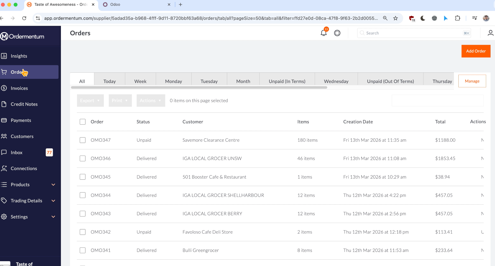
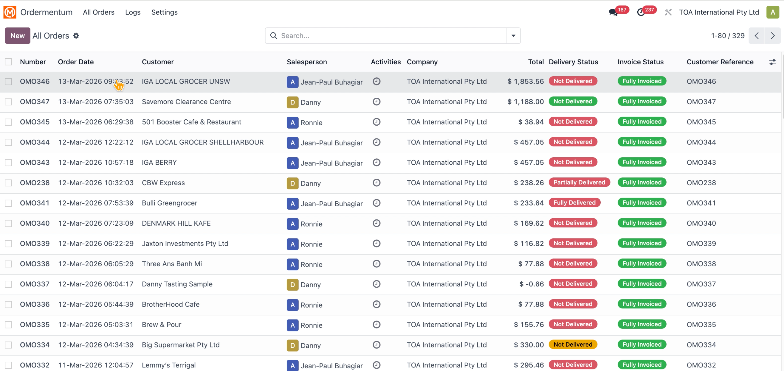

# Ordermentum Connector

Ordermentum is a B2B ordering and payments platform used by food and beverage suppliers to manage wholesale orders, invoices, and customer payments.

This Odoo 17 module integrates Ordermentum with Odoo sales, invoicing, delivery, and payment workflows.

## Demo

## Features

- Connects to Ordermentum API using configurable auth/API endpoints and cached access tokens.
- Imports and updates Ordermentum orders into Odoo Sales Orders.
- Supports Ordermentum webhook endpoint: `/ordermentum/webhook`.
- Auto-confirms sales orders and can auto-create/post invoices based on settings.
- Tracks Ordermentum order status, fulfilment type, purchaser ID, and sync timestamps.
- Registers paid Ordermentum invoices in Odoo using the configured payment journal.
- Sends delivery, payment, and invoice reminder email templates.
- Includes sync/webhook logs for easier troubleshooting.
- Integrates with the CartonCloud connector for 3PL fulfilment flows.

## Requirements

- Odoo 17.0
- Dependencies: `sale_management`, `stock`, `account`, `mail`, `cs_cartoncloud_connector`
- Valid Ordermentum API credentials and supplier UUID

## Configuration

After installation, configure the Ordermentum settings in Odoo:

- Auth Base URL
- API Base URL
- Username and password
- Supplier UUID
- Page size
- Payment journal
- Auto confirm / invoice options where required

## Technical Notes

The module adds Ordermentum fields to partners, sale orders, and invoices, provides scheduled jobs for polling Ordermentum orders, and stores detailed connector logs in `cs.ordermentum.log`.

## Author

Dan Tran

## License

OPL-1

